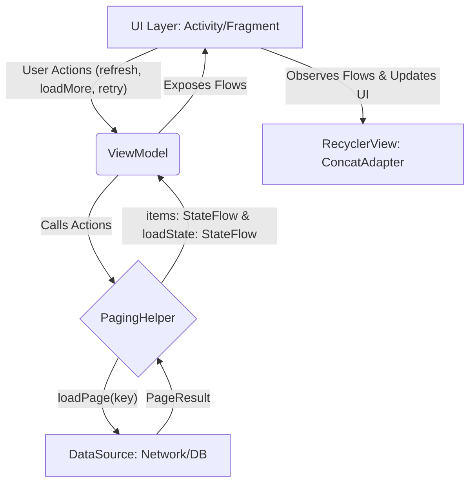

好的，我已经仔细检查了您整理的 Markdown 文档，发现了一些会导致渲染问题的小瑕疵。主要是部分代码块的语言标识符和标题层级的小问题。

下面是为您**修正并优化了格式**的最终版完整文档。您可以直接复制这段代码，它应该可以在任何标准的 Markdown 渲染器（如 GitHub, Typora, VS Code 预览等）中完美显示。

---

# 轻量级 Kotlin 分页框架：设计与实现文档 (V3.3)

## 1. 概述

本文档详细介绍了一个轻量级、自包含的 Kotlin 分页加载框架。该框架在**不依赖官方 `Paging-Runtime` 库**的前提下，参照 `Jetpack Paging3` 的核心思想进行设计，旨在为需要高度自定义和完全控制分页逻辑的场景提供一个简单、健壮且易于理解的解决方案。

**核心特性:**

*   **关注点分离 (SoC)**: 业务层、逻辑层和UI层职责清晰，高度解耦。
*   **状态驱动 UI**: 通过统一的、可携带数据的 `LoadState` 状态机，驱动UI展示所有分页状态。
*   **生命周期安全**: 所有监听器和异步任务均与组件生命周期绑定，杜绝内存泄漏。
*   **高性能**: 基于 `ListAdapter` 和 `DiffUtil` 实现高效的列表差分更新。
*   **卓越的用户体验**: 内置预加载、骨架屏占位符、结构化错误提示等功能。
*   **优雅的 API**: 提供类似官方库的 `withLoadStateFooter` 扩展函数，简化UI层代码。
*   **健壮性**: 内置并发控制（Mutex锁），确保数据一致性并防止重复请求。

## 2. 架构设计

框架遵循 MVVM 架构，数据流为单向流动，清晰可预测。



*   **DataSource**: 数据的唯一来源。负责根据 `Key` 获取分页数据并返回 `PageResult`。
*   **PagingHelper**: 分页逻辑的“大脑”。负责调用 `DataSource`、管理分页状态、处理并发和错误、生成数据流。
*   **ViewModel**: 业务逻辑的调度中心。持有 `PagingHelper`，并向 UI 层暴露干净的 `StateFlow` 和操作方法。
*   **UI Layer (Activity/Fragment)**: 负责展示。观察 `ViewModel` 的数据和状态，并将其驱动 `Adapter` 和其他 UI 组件的变化。

## 3. 核心组件详解

### 3.1. 接口与模型 (`PagingModels.kt`)

这部分定义了框架的基础数据结构和契约。

*   **`PageResult<Key, T>`**: 包装单次分页请求的结果，包含当前页数据和下一页的 `Key`。`nextKey` 为 `null` 代表数据已全部加载。
*   **`DataSource<Key, T>`**: 数据源接口，业务层必须实现它来提供分页数据。`loadPage` 的 `key` 参数为可空类型，以支持首次加载。
*   **`PagingError`**: 结构化的业务错误 `sealed class`，用于区分网络、服务器等不同错误类型，便于 UI 展示和后台监控。
*   **`LoadState`**: 驱动 UI 的 `sealed class` 状态机。`Error` 状态持有 `PagingError` 实例，提供了丰富的错误上下文。

### 3.2. 状态管理器 (`PagingHelper.kt`)

`PagingHelper` 是整个框架的核心，它是一个无状态（相对于UI）、线程安全的分页逻辑处理器。

*   **职责**:
    1.  通过 `Mutex` 锁确保任何时候只有一个加载任务在执行。
    2.  管理 `nextKey` 的流转。
    3.  在加载失败时，记录下完整的失败上下文（加载类型和所用的 `Key`），确保 `retry()` 操作的精确性。
    4.  调用 `DataSource` 获取数据，并处理成功/失败的结果。
    5.  向外暴露 `items` 和 `loadState` 两个 `StateFlow` 作为唯一可信的数据源。
    6.  (可选) 在刷新时，支持立即生成并推送一个占位符列表。

### 3.3. UI 组件 (`Adapters.kt`, `AdapterExtensions.kt`)

*   **`ArticleAdapter` (示例)**: 一个纯粹的 `ListAdapter`，它只关心如何渲染业务数据（包括真实数据和占位符），完全不知道分页的存在。
*   **`PagingLoadStateAdapter`**: 一个独立的 `Adapter`，专门负责渲染列表末尾的 `Footer`，根据传入的 `LoadState` 显示“加载中”、“加载失败”或“加载完成”的视图。
*   **`withLoadStateFooter` (扩展函数)**: 这是对 `ConcatAdapter` 的优雅封装。它提供了一个极其简洁的 API，可以将数据 `Adapter` 和状态 `Adapter` 合并，同时处理好 `ViewType` 的隔离，是提升代码可读性的关键。

## 4. 如何使用

集成此框架只需遵循以下简单步骤：

1.  **实现 `DataSource`**: 根据你的业务数据（如 `Article`），创建一个实现 `DataSource<Key, YourData>` 的类。
2.  **创建 `ViewModel`**: 在 `ViewModel` 中实例化 `DataSource`，然后创建 `PagingHelper`，并向外暴露 `items` 和 `loadState`。
3.  **创建数据 `Adapter`**: 创建一个继承自 `ListAdapter` 的 `Adapter`，用于渲染你的业务数据。
4.  **组装 UI**:
    *   在 `Activity` 或 `Fragment` 中，实例化 `ViewModel`、数据 `Adapter` 和 `PagingLoadStateAdapter`。
    *   使用 `articleAdapter.withLoadStateFooter(loadStateAdapter)` 创建最终的 `ConcatAdapter` 并设置给 `RecyclerView`。
    *   设置 `SwipeRefreshLayout` 和滚动监听器以实现下拉刷新和预加载。
    *   在 `repeatOnLifecycle(STARTED)` 块中，观察 `ViewModel` 的 `items` 和 `loadState`，并驱动 UI 更新。

## 5. 完整代码实现 (V3.3)

### 5.1. Gradle 依赖 (示例)
```groovy
// build.gradle.kts (Module)
dependencies {
    // ...
    implementation("androidx.core:core-ktx:1.9.0")
    implementation("androidx.appcompat:appcompat:1.6.1")
    implementation("androidx.constraintlayout:constraintlayout:2.1.4")
    implementation("androidx.lifecycle:lifecycle-viewmodel-ktx:2.6.2")
    implementation("androidx.lifecycle:lifecycle-runtime-ktx:2.6.2")
    implementation("androidx.recyclerview:recyclerview:1.3.2")
    implementation("androidx.swiperefreshlayout:swiperefreshlayout:1.1.0")

    // For Shimmer Effect (Placeholder)
    implementation("com.facebook.shimmer:shimmer:0.5.0")
}
```

### 5.2. Kotlin 源码

#### `PagingCore.kt` - 核心模型与引擎

这个文件包含了框架的基石：数据契约、状态机和分页逻辑处理器。

```kotlin
package com.example.custompaging.production.final

import kotlinx.coroutines.CoroutineScope
import kotlinx.coroutines.flow.MutableStateFlow
import kotlinx.coroutines.flow.StateFlow
import kotlinx.coroutines.flow.asStateFlow
import kotlinx.coroutines.launch
import kotlinx.coroutines.sync.Mutex
import kotlinx.coroutines.sync.withLock
import java.io.IOException

// region ==================== 1. 核心接口 & 状态模型 ====================

/**
 * 分页加载结果的数据类，是数据源返回数据的标准包装。
 *
 * @param Key 类型参数，表示下一页的键，可以是页码(Int)、Cursor(String)等。
 * @param T 类型参数，表示列表项数据的类型。
 * @property data 当前页的数据列表。
 * @property nextKey 下一页的请求键。如果为 null，表示已经没有更多数据。
 */
data class PageResult<Key, T>(
    val data: List<T>,
    val nextKey: Key?
)

/**
 * 数据源接口，定义了数据加载的契约。业务层需要实现此接口来提供具体的分页数据。
 */
interface DataSource<Key, T> {
    /**
     * 加载分页数据。这是一个挂起函数，因为它通常执行网络或数据库等IO操作。
     * @param key 当前页的请求键。
     * [S1] 修正：此参数为可空类型，以兼容首次加载（key通常为null）的场景。
     * @return 包含数据和下一页键的 [PageResult]。
     */
    suspend fun loadPage(key: Key?): PageResult<Key, T>

    /**
     * 提供初始加载的键。
     * @return 初始加载键。如果从第一页开始，可以返回 0 或 null。
     */
    fun getInitialKey(): Key?
}

/**
 * [增强] 结构化的业务错误实体，用于精确的错误处理和监控。
 * 相比直接使用 Throwable，它可以提供更丰富的业务上下文。
 */
sealed class PagingError {
    /** 网络相关的错误，如无连接、超时等。 */
    data class Network(val cause: Throwable) : PagingError()
    /** 服务器返回的业务错误。 */
    data class Server(val code: Int, val message: String) : PagingError()
    /** 其他未知错误。 */
    data class Unknown(val cause: Throwable) : PagingError()
}

/**
 * [增强] 将底层异常映射为定义的业务错误的扩展函数。
 * 这层转换使得 PagingHelper 与具体的异常类型解耦。
 */
fun Throwable.toPagingError(): PagingError = when (this) {
    is IOException -> PagingError.Network(this)
    // 在实际项目中，这里可以判断 Retrofit 的 HttpException 等更具体的网络错误类型
    // is HttpException -> PagingError.Server(this.code(), this.message())
    else -> PagingError.Unknown(this)
}

/**
 * [增强] 列表加载状态机，使用 sealed class 以便在 Error 状态中携带数据。
 */
sealed class LoadState {
    /** 正在加载中状态。 */
    object Loading : LoadState()
    /** 加载失败状态，持有具体的 [PagingError] 信息。 */
    data class Error(val error: PagingError) : LoadState()
    /** 已加载全部数据，没有更多了。 */
    object End : LoadState()
    /** 非加载状态，且仍有更多数据可供加载。 */
    object NotLoading : LoadState()
}

// endregion

// region ==================== 2. 状态管理器 PagingHelper ====================

private enum class LoadType { REFRESH, APPEND }

/**
 * 分页核心帮助类，是整个分页框架的“大脑”。
 * 它管理所有分页逻辑、状态和数据，并且是线程安全的。
 *
 * @param scope CoroutineScope，通常是 ViewModelScope，用于启动加载协程。
 * @param dataSource 业务层实现的数据源实例。
 * @param placeholderGenerator [增强] 一个可选的函数，用于在刷新时即时生成占位符列表以改善用户体验。
 */
class PagingHelper<Key : Any, T : Any>(
    private val scope: CoroutineScope,
    private val dataSource: DataSource<Key, T>,
    private val placeholderGenerator: (() -> List<T>)? = null
) {
    private val mutex = Mutex()

    private val _loadState = MutableStateFlow<LoadState>(LoadState.NotLoading)
    val loadState: StateFlow<LoadState> = _loadState.asStateFlow()

    private val _items = MutableStateFlow<List<T>>(emptyList())
    val items: StateFlow<List<T>> = _items.asStateFlow()

    private var nextKey: Key? = dataSource.getInitialKey()
    
    /** [A1] 修正：保存完整的失败上下文（加载类型和所用的Key），以确保重试的绝对准确性。 */
    private var lastFailedCall: Pair<LoadType, Key?>? = null

    /** 触发刷新操作。会清空数据并从头开始加载。 */
    fun refresh() = scope.launch {
        // [增强] 如果提供了占位符生成器，则在网络请求前立即显示占位符。
        placeholderGenerator?.let { _items.value = it() }
        performLoad(LoadType.REFRESH, dataSource.getInitialKey())
    }

    /** 触发加载更多操作。 */
    fun loadMore() = scope.launch { performLoad(LoadType.APPEND, nextKey) }

    /** 重试上一次失败的操作，无论是刷新失败还是加载更多失败。 */
    fun retry() = scope.launch { lastFailedCall?.let { (type, key) -> performLoad(type, key) } }

    /**
     * 执行实际的加载操作，内部通过 Mutex 保证原子性和线程安全。
     */
    private suspend fun performLoad(loadType: LoadType, key: Key?) {
        // [B1] 通过检查当前状态，天然地实现了防抖/节流。如果正在加载，则直接忽略新的加载更多请求。
        if (loadType == LoadType.APPEND && _loadState.value is LoadState.Loading) return

        mutex.withLock {
            // 在锁内进行双重检查，确保并发安全。
            if (loadType == LoadType.APPEND && (_loadState.value is LoadState.Loading || _loadState.value is LoadState.End)) return

            _loadState.value = LoadState.Loading
            runCatching {
                dataSource.loadPage(key)
            }.onSuccess { result ->
                lastFailedCall = null // 成功后清除失败记录
                nextKey = result.nextKey
                
                // 如果是刷新，或者当前列表是占位符，则完全替换列表；否则追加数据。
                val currentItems = if (loadType == LoadType.REFRESH || _items.value.any { it is ListItem.Placeholder }) emptyList() else _items.value
                _items.value = currentItems + result.data
                
                _loadState.value = if (result.nextKey == null) LoadState.End else LoadState.NotLoading
            }.onFailure { throwable ->
                lastFailedCall = loadType to key // 记录失败的上下文
                // [增强] 使用映射后的业务错误更新状态
                _loadState.value = LoadState.Error(throwable.toPagingError())
            }
        }
    }
}
// endregion
```

#### `PagingUi.kt` - UI 相关组件

这个文件包含了所有与 RecyclerView 相关的 Adapter 和扩展函数。

```kotlin
package com.example.custompaging.production.final

import android.view.LayoutInflater
import android.view.View
import android.view.ViewGroup
import android.widget.Button
import android.widget.ProgressBar
import android.widget.TextView
import androidx.core.view.isVisible
import androidx.recyclerview.widget.ConcatAdapter
import androidx.recyclerview.widget.DiffUtil
import androidx.recyclerview.widget.ListAdapter
import androidx.recyclerview.widget.RecyclerView
import androidx.recyclerview.widget.StaggeredGridLayoutManager
import com.facebook.shimmer.ShimmerFrameLayout

// region ==================== 3. UI 组件 (Adapter & Extensions) ====================

/**
 * [增强] 使用 Sealed Interface 统一表示列表中的所有可能项。
 * 这使得 Adapter 可以用一种类型安全的方式处理多种视图。
 */
sealed interface ListItem {
    /** 代表一条真实的业务数据。 */
    data class ArticleItem(val article: Article) : ListItem
    /** 代表一个用于加载状态的占位符。 */
    object Placeholder : ListItem
}

/**
 * 纯粹的数据 Adapter，通过 [ListAdapter] 实现，支持渲染真实数据和占位符两种视图。
 * 它完全不知道分页逻辑的存在，职责单一。
 */
class ArticleAdapter : ListAdapter<ListItem, RecyclerView.ViewHolder>(
    diffCallback = object : DiffUtil.ItemCallback<ListItem>() {
        override fun areItemsTheSame(old: ListItem, new: ListItem): Boolean =
            (old is ListItem.ArticleItem && new is ListItem.ArticleItem && old.article.id == new.article.id) ||
            (old is ListItem.Placeholder && new is ListItem.Placeholder)
        override fun areContentsTheSame(old: ListItem, new: ListItem): Boolean = old == new
    }
) {
    companion object {
        private const val TYPE_ARTICLE = 0
        private const val TYPE_PLACEHOLDER = 1
    }

    class ArticleViewHolder(view: View) : RecyclerView.ViewHolder(view) {
        val titleView: TextView = view.findViewById(R.id.article_title)
    }

    class PlaceholderViewHolder(view: View) : RecyclerView.ViewHolder(view) {
        init { (itemView as? ShimmerFrameLayout)?.startShimmer() }
    }

    override fun getItemViewType(position: Int): Int = when (getItem(position)) {
        is ListItem.ArticleItem -> TYPE_ARTICLE
        is ListItem.Placeholder -> TYPE_PLACEHOLDER
    }

    override fun onCreateViewHolder(parent: ViewGroup, viewType: Int): RecyclerView.ViewHolder = if (viewType == TYPE_ARTICLE) {
        ArticleViewHolder(LayoutInflater.from(parent.context).inflate(R.layout.list_item_article, parent, false))
    } else {
        PlaceholderViewHolder(LayoutInflater.from(parent.context).inflate(R.layout.list_item_placeholder, parent, false))
    }

    override fun onBindViewHolder(holder: RecyclerView.ViewHolder, position: Int) {
        if (holder is ArticleViewHolder) {
            (getItem(position) as? ListItem.ArticleItem)?.let { holder.titleView.text = "ID: ${it.article.id} - ${it.article.title}" }
        }
    }
}

/**
 * Footer Adapter，专门负责展示 Loading / Error / End 状态，设计与 [ConcatAdapter] 配合使用。
 */
class PagingLoadStateAdapter(private val retry: () -> Unit) : RecyclerView.Adapter<PagingLoadStateAdapter.LoadStateViewHolder>() {
    var loadState: LoadState = LoadState.NotLoading
        set(value) {
            if (field != value) {
                val oldItemVisible = displayAsItem(field)
                val newItemVisible = displayAsItem(value)
                field = value
                if (oldItemVisible != newItemVisible) { if (newItemVisible) notifyItemInserted(0) else notifyItemRemoved(0) }
                else if (newItemVisible) { notifyItemChanged(0) }
            }
        }
    /** [B3] 修正：由外部告知数据列表是否为空，以解决空列表时还显示 "已到底" footer 的问题。 */
    var isDataEmpty: Boolean = true
        set(value) {
            if (field != value) {
                field = value
                if (displayAsItem(loadState)) { if (value) notifyItemRemoved(0) else notifyItemInserted(0) }
            }
        }

    private fun displayAsItem(state: LoadState) = state is LoadState.Loading || state is LoadState.Error || state is LoadState.End
    override fun getItemCount(): Int = if (!isDataEmpty && displayAsItem(loadState)) 1 else 0
    override fun onCreateViewHolder(parent: ViewGroup, vt: Int) = LoadStateViewHolder(LayoutInflater.from(parent.context).inflate(R.layout.list_item_footer, parent, false), retry)
    override fun onBindViewHolder(holder: LoadStateViewHolder, pos: Int) = holder.bind(loadState)

    class LoadStateViewHolder(itemView: View, retry: () -> Unit) : RecyclerView.ViewHolder(itemView) {
        private val progress: ProgressBar = itemView.findViewById(R.id.footer_progress)
        private val retryButton: Button = itemView.findViewById(R.id.footer_retry_button)
        private val endText: TextView = itemView.findViewById(R.id.footer_end_text)
        init { retryButton.setOnClickListener { retry() } }
        fun bind(state: LoadState) {
            /** [B2] 修正：仅在 StaggeredGridLayoutManager 下设置 isFullSpan，增强通用性。 */
            (itemView.layoutParams as? StaggeredGridLayoutManager.LayoutParams)?.isFullSpan = true
            progress.isVisible = state is LoadState.Loading
            retryButton.isVisible = state is LoadState.Error
            endText.isVisible = state is LoadState.End
        }
    }
}

/**
 * [最终优化] 一个自定义的扩展函数，模仿 Paging3 库的便捷 API。
 * 它将数据 Adapter 和 PagingLoadStateAdapter 优雅地合并成一个 ConcatAdapter，
 * 隐藏了 ConcatAdapter 的配置细节，使调用代码更简洁。
 *
 * @receiver 数据 Adapter (例如 ArticleAdapter)。
 * @param footer 用于展示加载状态的 PagingLoadStateAdapter。
 * @return 一个配置好的、包含数据和页脚的 ConcatAdapter。
 */
fun <T : RecyclerView.Adapter<out RecyclerView.ViewHolder>> T.withLoadStateFooter(
    footer: PagingLoadStateAdapter
): ConcatAdapter {
    val config = ConcatAdapter.Config.Builder()
        .setIsolateViewTypes(true) // 关键！确保子 Adapter 的 ViewType 不会相互冲突。
        .build()
    return ConcatAdapter(config, this, footer)
}
// endregion
```

#### `ArticleFeature.kt` - 业务实现与UI组装

这个文件展示了如何使用上面的核心组件来构建一个具体的功能模块。

```kotlin
package com.example.custompaging.production.final

import android.os.Bundle
import android.view.View
import android.widget.TextView
import androidx.appcompat.app.AppCompatActivity
import androidx.core.view.isVisible
import androidx.lifecycle.Lifecycle
import androidx.lifecycle.ViewModel
import androidx.lifecycle.ViewModelProvider
import androidx.lifecycle.lifecycleScope
import androidx.lifecycle.repeatOnLifecycle
import androidx.lifecycle.viewModelScope
import androidx.recyclerview.widget.LinearLayoutManager
import androidx.recyclerview.widget.RecyclerView
import androidx.swiperefreshlayout.widget.SwipeRefreshLayout
import kotlinx.coroutines.awaitCancellation
import kotlinx.coroutines.delay
import kotlinx.coroutines.launch
import java.io.IOException
import kotlin.random.Random

// region ==================== 4. 业务逻辑层 (ViewModel & Model) ====================

data class Article(val id: Int, val title: String)

class ArticleViewModel : ViewModel() {
    private val articleDataSource = object : DataSource<Int, ListItem> {
        override fun getInitialKey(): Int? = null
        override suspend fun loadPage(key: Int?): PageResult<Int, ListItem> {
            val currentPage = key ?: 0
            delay(1500)
            if (currentPage == 1 && Random.nextBoolean()) throw IOException("Mock network error!")
            val isEnd = currentPage >= 4
            val articles = if (isEnd) emptyList() else List(20) {
                ListItem.ArticleItem(Article(currentPage * 20 + it, "Article Title"))
            }
            return PageResult(data = articles, nextKey = if (isEnd) null else currentPage + 1)
        }
    }

    private val helper = PagingHelper(viewModelScope, articleDataSource, placeholderGenerator = { List(10) { ListItem.Placeholder } })

    val items: StateFlow<List<ListItem>> = helper.items
    val loadState: StateFlow<LoadState> = helper.loadState

    fun refresh() = helper.refresh()
    fun loadMore() = helper.loadMore()
    fun retry() = helper.retry()
}

// endregion

// region ==================== 5. UI展现层 (Activity) ====================

class MainActivity : AppCompatActivity() {
    companion object {
        /** [增强] 将预加载阈值提取为可配置常量，便于维护和调整。 */
        private const val PRELOAD_OFFSET = 5
    }
    private val viewModel: ArticleViewModel by lazy { ViewModelProvider(this)[ArticleViewModel::class.java] }
    private val articleAdapter = ArticleAdapter()
    private val loadStateAdapter = PagingLoadStateAdapter { viewModel.retry() }

    override fun onCreate(savedInstanceState: Bundle?) {
        super.onCreate(savedInstanceState)
        setContentView(R.layout.activity_main)
        setupUI()
        setupObservers()
        if (savedInstanceState == null) viewModel.refresh()
    }

    private fun setupUI() {
        val recyclerView: RecyclerView = findViewById(R.id.recycler_view)
        val swipeRefresh: SwipeRefreshLayout = findViewById(R.id.swipe_refresh_layout)
        
        // 使用我们优雅的扩展函数来组装 Adapter
        val concatAdapter = articleAdapter.withLoadStateFooter(loadStateAdapter)
        recyclerView.adapter = concatAdapter
        recyclerView.layoutManager = LinearLayoutManager(this)

        // 使用 repeatOnLifecycle 来实现生命周期安全的监听器绑定
        lifecycleScope.launch {
            repeatOnLifecycle(Lifecycle.State.STARTED) {
                val scrollListener = object : RecyclerView.OnScrollListener() {
                    override fun onScrolled(rv: RecyclerView, dx: Int, dy: Int) {
                        if (dy > 0) { // 只在向下滑动时检查
                            (rv.layoutManager as? LinearLayoutManager)?.let {
                                if (it.findLastVisibleItemPosition() >= concatAdapter.itemCount - PRELOAD_OFFSET) {
                                    viewModel.loadMore()
                                }
                            }
                        }
                    }
                }
                recyclerView.addOnScrollListener(scrollListener)
                // 当 lifecycle 离开 STARTED 状态，协程会被取消，finally 块保证监听器被移除。
                try { awaitCancellation() } finally { recyclerView.removeOnScrollListener(scrollListener) }
            }
        }
        
        swipeRefresh.setOnRefreshListener {
            swipeRefresh.isRefreshing = true
            viewModel.refresh()
        }
    }

    private fun setupObservers() {
        val swipeRefresh: SwipeRefreshLayout = findViewById(R.id.swipe_refresh_layout)
        val fullScreenError: View = findViewById(R.id.full_screen_error_view)
        val emptyView: View = findViewById(R.id.empty_view)
        val errorTextView: TextView = findViewById(R.id.error_text_view)
        val errorRetryButton: View = findViewById(R.id.error_retry_button)

        errorRetryButton.setOnClickListener { viewModel.refresh() }

        lifecycleScope.launch {
            repeatOnLifecycle(Lifecycle.State.STARTED) {
                // 观察数据流
                launch {
                    viewModel.items.collect { list ->
                        articleAdapter.submitList(list)
                        loadStateAdapter.isDataEmpty = list.isEmpty()
                    }
                }
                // 观察状态流
                launch {
                    viewModel.loadState.collect { state ->
                        loadStateAdapter.loadState = state
                        if (state !is LoadState.Loading) swipeRefresh.isRefreshing = false

                        val isListEffectivelyEmpty = articleAdapter.currentList.isEmpty() || articleAdapter.currentList.all { it is ListItem.Placeholder }
                        
                        fullScreenError.isVisible = isListEffectivelyEmpty && state is LoadState.Error
                        if (state is LoadState.Error) {
                            errorTextView.text = when(val error = state.error) {
                                is PagingError.Network -> "网络连接失败，请检查设置"
                                is PagingError.Server -> "服务器开小差了 (Code: ${error.code})"
                                is PagingError.Unknown -> "发生未知错误"
                            }
                        }
                        emptyView.isVisible = isListEffectivelyEmpty && state is LoadState.End
                    }
                }
            }
        }
    }
}
// endregion
```

### 5.3. XML 布局文件

#### `activity_main.xml`
```xml
<?xml version="1.0" encoding="utf-8"?>
<androidx.constraintlayout.widget.ConstraintLayout
    xmlns:android="http://schemas.android.com/apk/res/android"
    xmlns:app="http://schemas.android.com/apk/res-auto"
    android:layout_width="match_parent"
    android:layout_height="match_parent">
    
    <androidx.swiperefreshlayout.widget.SwipeRefreshLayout
        android:id="@+id/swipe_refresh_layout"
        android:layout_width="match_parent"
        android:layout_height="match_parent">
        <androidx.recyclerview.widget.RecyclerView
            android:id="@+id/recycler_view"
            android:layout_width="match_parent"
            android:layout_height="match_parent"
            android:scrollbars="vertical"
            app:layoutManager="androidx.recyclerview.widget.LinearLayoutManager"/>
    </androidx.swiperefreshlayout.widget.SwipeRefreshLayout>

    <LinearLayout
        android:id="@+id/full_screen_error_view"
        android:layout_width="wrap_content"
        android:layout_height="wrap_content"
        android:orientation="vertical"
        android:gravity="center"
        android:padding="32dp"
        android:visibility="gone"
        app:layout_constraintTop_toTopOf="parent"
        app:layout_constraintBottom_toBottomOf="parent"
        app:layout_constraintStart_toStartOf="parent"
        app:layout_constraintEnd_toEndOf="parent">
        <TextView android:id="@+id/error_text_view" android:layout_width="wrap_content" android:layout_height="wrap_content" android:layout_marginBottom="16dp"/>
        <Button android:id="@+id/error_retry_button" android:text="重试" android:layout_width="wrap_content" android:layout_height="wrap_content"/>
    </LinearLayout>

    <TextView
        android:id="@+id/empty_view"
        android:layout_width="wrap_content"
        android:layout_height="wrap_content"
        android:text="这里什么都没有"
        android:visibility="gone"
        app:layout_constraintTop_toTopOf="parent"
        app:layout_constraintBottom_toBottomOf="parent"
        app:layout_constraintStart_toStartOf="parent"
        app:layout_constraintEnd_toEndOf="parent" />
</androidx.constraintlayout.widget.ConstraintLayout>
```

#### `list_item_article.xml`
```xml
<?xml version="1.0" encoding="utf-8"?>
<LinearLayout
    xmlns:android="http://schemas.android.com/apk/res/android"
    xmlns:tools="http://schemas.android.com/tools"
    android:layout_width="match_parent"
    android:layout_height="wrap_content"
    android:orientation="vertical"
    android:paddingStart="16dp"
    android:paddingEnd="16dp"
    android:paddingTop="12dp"
    android:paddingBottom="12dp"
    android:background="?android:attr/selectableItemBackground"
    android:clickable="true"
    android:focusable="true">

    <TextView
        android:id="@+id/article_title"
        android:layout_width="match_parent"
        android:layout_height="wrap_content"
        android:textSize="16sp"
        android:textColor="@android:color/black"
        android:textStyle="bold"
        tools:text="ID: 123 - This is a sample article title" />
</LinearLayout>
```

#### `list_item_placeholder.xml`
```xml
<?xml version="1.0" encoding="utf-8"?>
<com.facebook.shimmer.ShimmerFrameLayout
    xmlns:android="http://schemas.android.com/apk/res/android"
    android:layout_width="match_parent"
    android:layout_height="wrap_content">
    <LinearLayout
        android:layout_width="match_parent"
        android:layout_height="wrap_content"
        android:orientation="vertical"
        android:padding="16dp">
        <View android:layout_width="match_parent" android:layout_height="20dp" android:background="#E0E0E0"/>
        <View android:layout_width="150dp" android:layout_height="20dp" android:layout_marginTop="8dp" android:background="#E0E0E0"/>
    </LinearLayout>
</com.facebook.shimmer.ShimmerFrameLayout>
```

#### `list_item_footer.xml`
```xml
<?xml version="1.0" encoding="utf-8"?>
<LinearLayout
    xmlns:android="http://schemas.android.com/apk/res/android"
    xmlns:tools="http://schemas.android.com/tools"
    android:layout_width="match_parent"
    android:layout_height="wrap_content"
    android:orientation="horizontal"
    android:gravity="center"
    android:padding="16dp">

    <ProgressBar
        android:id="@+id/footer_progress"
        android:layout_width="wrap_content"
        android:layout_height="wrap_content"
        android:visibility="gone"
        tools:visibility="visible" />

    <Button
        android:id="@+id/footer_retry_button"
        android:layout_width="wrap_content"
        android:layout_height="wrap_content"
        android:text="加载失败，点击重试"
        android:visibility="gone" />

    <TextView
        android:id="@+id/footer_end_text"
        android:layout_width="wrap_content"
        android:layout_height="wrap_content"
        android:text="--- 我是有底线的 ---"
        android:textColor="@android:color/darker_gray"
        android:textSize="14sp"
        android:visibility="gone" />
</LinearLayout>
```